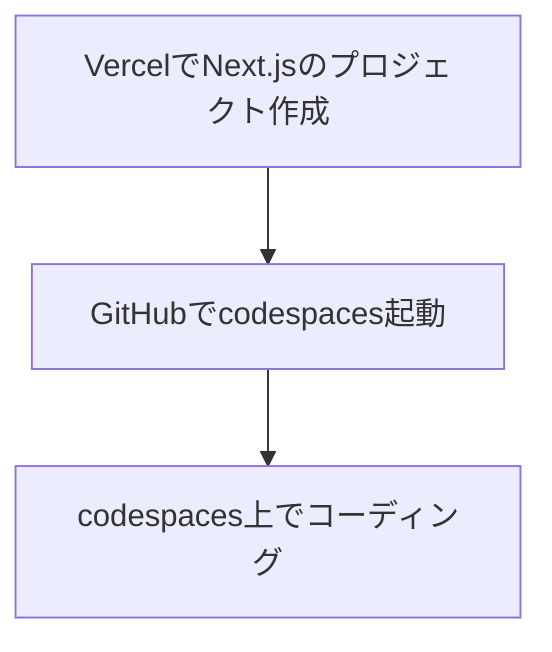

ここから実際にLINEログインを使った簡単なアプリケーションを構築しながら、セキュアなログインを学んでいきます。

# 事前準備

本書では以下のサービスを利用する形で進めていきます。

GitHub

https://github.com/

Vercel

https://vercel.com/

LINE Developers

https://developers.line.biz/ja

これらのサービスは趣味程度の個人的な利用であれば料金の発生などは特にありません。また、アプリケーションの実装で使用するエディタについては本書ではGitHubが提供する`codespaces`を利用する形で進めます。
ちなみにVercelはGitHubとの連携も行うことを予定しているのでGitHubのアカウントでユーザー登録しておくことをおすすめします。

https://github.co.jp/features/codespaces

# 開発の流れ

本書では以下の流れで開発環境の立ち上げを行います。

codespacesで開発を行う場合は特にローカルでの開発環境の構築作業は必要ありません。
